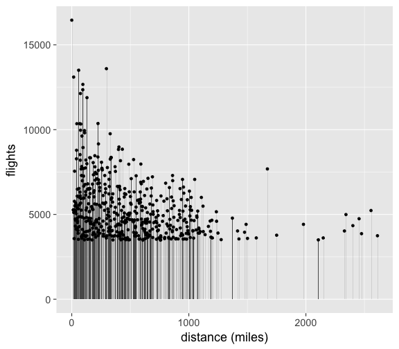

enigma
=======


[](https://travis-ci.org/rOpenGov/enigma)
<!-- [](https://coveralls.io/r/rOpenGov/enigma) -->
[](https://codecov.io/github/rOpenGov/enigma?branch=master)
[](https://github.com/metacran/cranlogs.app)
[](https://cran.r-project.org/package=enigma)

**An R client for [Enigma.io](https://app.enigma.io/)**

Enigma holds government data and provides a really nice set of APIs for data, metadata, and stats on each of the datasets. That is, you can request a dataset itself, metadata on the dataset, and summary statistics on the columns of each dataset.

## Enigma.io

+ [Enigma.io home page](https://app.enigma.io/)
+ [Enigma.io API docs](https://app.enigma.io/api)

## License

MIT, see [LICENSE file](https://github.com/rOpenGov/enigma/blob/master/LICENSE) and [MIT text](http://opensource.org/licenses/MIT)

## Install

Stable version from CRAN


```r
install.packages("enigma")
```

Or development version from GitHub


```r
install.packages("devtools")
devtools::install_github("ropengov/enigma")
```


```r
library("enigma")
```

### Get data


```r
out <- enigma_data(dataset='us.gov.whitehouse.visitor-list', select=c('namelast','visitee_namelast','last_updatedby'))
```

Some metadata on the results


```r
out$info
#> $rows_limit
#> [1] 500
#> 
#> $total_results
#> [1] 4462510
#> 
#> $total_pages
#> [1] 8926
#> 
#> $current_page
#> [1] 1
#> 
#> $calls_remaining
#> [1] 49914
#> 
#> $seconds_remaining
#> [1] 2084748
```

Look at the data, first 6 rows for readme brevity


```r
head(out$result)
#>   namelast visitee_namelast last_updatedby
#> 1 MATTHEWS            POTUS             LC
#> 2    DOYLE            POTUS             B3
#> 3 MATTHEWS            POTUS             LC
#> 4   MALONE            POTUS             DC
#> 5   WILSON            POTUS             DC
#> 6    ABEBE            POTUS             GB
```


### Statistics on dataset columns


```r
out <- enigma_stats(dataset='us.gov.whitehouse.visitor-list', select='total_people')
```

Some summary stats


```r
out$result[c('sum','avg','stddev','variance','min','max')]
#> $sum
#> [1] "1245086302"
#> 
#> $avg
#> [1] "280.4864992845274096"
#> 
#> $stddev
#> [1] "533.430430655024"
#> 
#> $variance
#> [1] "284548.024348804258"
#> 
#> $min
#> [1] "0"
#> 
#> $max
#> [1] "5730"
```


Frequency details


```r
head(out$result$frequency)
#>   total_people  count
#> 1            1 205885
#> 2            6 126360
#> 3            2 124847
#> 4            4 101829
#> 5            3 100926
#> 6          275  89107
```


### Metadata on datasets


```r
out <- enigma_metadata(dataset='us.gov.whitehouse')
```

Paths


```r
out$info$paths
#> [[1]]
#> [[1]]$level
#> [1] "us"
#> 
#> [[1]]$label
#> [1] "United States"
#> 
#> [[1]]$description
#> [1] "United States of America"
#> 
#> [[1]]$description_lead
#> [1] "United States of America"
#> 
#> 
#> [[2]]
#> [[2]]$level
#> [1] "gov"
#> 
#> [[2]]$label
#> [1] "U.S. Federal Government"
#> 
#> [[2]]$description
#> [1] "Government from the Legislative, Executive, and Judicial branches of the United States of America."
#> 
#> [[2]]$description_lead
#> [1] "Government comprising the Legislative, Executive, and Judicial branches of the United States of America."
#> 
#> 
#> [[3]]
#> [[3]]$level
#> [1] "whitehouse"
#> 
#> [[3]]$label
#> [1] "The White House"
#> 
#> [[3]]$description
#> [1] "Located at 1600 Pennsylvania Avenue in Washington D.C., the White House has served as the home and office for every U.S. president since John Adams."
#> 
#> [[3]]$description_lead
#> [1] "Located at 1600 Pennsylvania Avenue in Washington D.C., the White House has served as the home and office for every U.S. president since John Adams."
```

Immediate nodes


```r
out$info$immediate_nodes
#> [[1]]
#> [[1]]$datapath
#> [1] "us.gov.whitehouse.salaries"
#> 
#> [[1]]$label
#> [1] "White House Salaries"
#> 
#> [[1]]$description
#> [1] "The White House has been required to deliver a report to Congress listing the title and salary of every White House Office employee since 1995.  Consistent with President Obama's commitment to transparency, this report is being publicly disclosed on our website as it is transmitted to Congress.  In addition, this report also contains the title and salary details of administration officials who work at the Office of Policy Development, including the Domestic Policy Council and the National Economic Council -- along with White House Office employees."
```


Children tables


```r
out$info$children_tables[[1]]
#> $datapath
#> [1] "us.gov.whitehouse.visitor-list"
#> 
#> $label
#> [1] "Visitor Records"
#> 
#> $description
#> [1] "Records of visitors to the White House from September 2009 to present."
#> 
#> $db_boundary_datapath
#> [1] "us.gov.whitehouse"
#> 
#> $db_boundary_label
#> [1] ""
```


### Use case: Plot frequency of flight distances

First, get columns for the air carrier dataset


```r
dset <- 'us.gov.dot.rita.trans-stats.air-carrier-statistics.t100d-market-all-carrier'
head(enigma_metadata(dset)$columns$table[,c(1:4)])
#>               id          label         type index
#> 1     passengers     Passengers type_numeric     0
#> 2        freight Freight (Lbs.) type_numeric     1
#> 3           mail    Mail (Lbs.) type_numeric     2
#> 4       distance Distance (Mi.) type_numeric     3
#> 5 unique_carrier Unique Carrier type_varchar     4
#> 6     airline_id     Airline ID type_varchar     5
```


Looks like there's a column called _distance_ that we can search on. We by default for `varchar` type columns only `frequency` bake for the column.


```r
out <- enigma_stats(dset, select='distance')
head(out$result$frequency)
#>   distance count
#> 1     0.00 16456
#> 2   296.00 13595
#> 3    59.00 13504
#> 4    16.00 13101
#> 5    95.00 12669
#> 6    94.00 12354
```

Then we can do a bit of tidying and make a plot


```r
library("ggplot2")
df <- out$result$frequency
df <- data.frame(distance=as.numeric(df$distance), count=as.numeric(df$count))
ggplot(df, aes(distance, count)) +
  geom_bar(stat="identity") +
  geom_point() +
  theme_grey(base_size = 18) +
  labs(y="flights", x="distance (miles)")
```

 

### Direct dataset download

Enigma provides an endpoint `.../export/<datasetid>` to download a zipped csv file of the entire dataset.

`enigma_fetch()` gives you an easy way to download these to a specific place on your machine. And a message tells you that a file has been written to disk.

```r
enigma_fetch(dataset='com.crunchbase.info.companies.acquisition')
```
