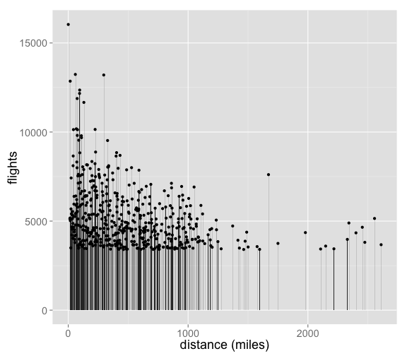

enigma
=======

[](https://travis-ci.org/rOpenGov/enigma)

**An R client for [Enigma.io](https://app.enigma.io/)**

Enigma holds government data and provides a really nice set of APIs for data, metadata, and stats on each of the datasets. That is, you can request a dataset itself, metadata on the dataset, and summary statistics on the columns of each dataset.

## enigma info

+ [enigma home page](https://app.enigma.io/)
+ [API docs](https://app.enigma.io/api)

## LICENSE

MIT, see [LICENSE file](https://github.com/rOpenGov/enigma/blob/master/LICENSE) and [MIT text](http://opensource.org/licenses/MIT)

## Quick start

### Install


```r
install.packages("devtools")
library("devtools")
install_github("ropengov/enigma")
```


```r
library("enigma")
```


### Get data


```r
out <- enigma_data(dataset = "us.gov.whitehouse.visitor-list", select = c("namelast",
    "visitee_namelast", "last_updatedby"))
```


Some metadata on the results


```r
out$info
```

```
##    rows_limit total_results   total_pages  current_page
##            50       3577135         71543             1
```


Look at the data, first 6 rows for readme brevity


```r
head(out$result)
```

```
##   namelast visitee_namelast last_updatedby
## 1   BELBAS           OFFICE             T1
## 2     BOUL            POTUS             J7
## 3   VITALE             TING             GB
## 4   VITALE             TING             GB
## 5   VITALE             TING             GB
## 6   VITALE             TING             GB
```


### Statistics on dataset columns


```r
out <- enigma_stats(dataset = "us.gov.whitehouse.visitor-list", select = "total_people")
```


Some summary stats


```r
out$result[c("sum", "avg", "stddev", "variance", "min", "max")]
```

```
## $sum
## [1] "1028567261"
##
## $avg
## [1] "289.0040005540871372"
##
## $stddev
## [1] "520.769872911814"
##
## $variance
## [1] "271201.260532586939"
##
## $min
## [1] "0"
##
## $max
## [1] "5730"
```


Frequency details


```r
head(out$result$frequency)
```

```
##   total_people  count
## 1            1 158256
## 2            2  98349
## 3            6  96922
## 4            3  79896
## 5            4  79100
## 6            5  67575
```


### Metadata on datasets


```r
out <- enigma_metadata(dataset = "us.gov.whitehouse")
```


Paths


```r
out$info$paths
```

```
## [[1]]
## [[1]]$level
## [1] "us"
##
## [[1]]$label
## [1] "United States"
##
## [[1]]$description
## [1] "United States"
##
##
## [[2]]
## [[2]]$level
## [1] "gov"
##
## [[2]]$label
## [1] "U.S. Federal Government"
##
## [[2]]$description
## [1] "Government comprising the Legislative, Executive, and Judicial branches of the United States of America."
##
##
## [[3]]
## [[3]]$level
## [1] "whitehouse"
##
## [[3]]$label
## [1] "The White House"
##
## [[3]]$description
## [1] "Located at 1600 Pennsylvania Avenue in Washington D.C., the White House has served as the home and office for every U.S. president since John Adams."
```


Immediate nodes


```r
out$info$immediate_nodes
```

```
## [[1]]
## [[1]]$datapath
## [1] "us.gov.whitehouse.salaries"
##
## [[1]]$label
## [1] "White House Salaries"
##
## [[1]]$description
## [1] "The White House report to Congress listing the title and salary of every White House Office employee since 1995."
```


Children tables


```r
out$info$children_tables[[1]]
```

```
## $datapath
## [1] "us.gov.whitehouse.nom-and-app"
##
## $label
## [1] "Nominations & Appointments"
##
## $description
## [1] "The nominees and appointees names, positions, agencies under which they are nominated or appointed, the agency's websites, nomination dates, and vote confirmation dates."
##
## $db_boundary_datapath
## [1] "us.gov.whitehouse"
##
## $db_boundary_label
## [1] "The White House"
```


### Use case: Plot frequency of flight distances

First, get columns for the air carrier dataset


```r
dset <- "us.gov.dot.rita.trans-stats.air-carrier-statistics.t100d-market-all-carrier"
head(enigma_metadata(dset)$columns$table[, c(1:4)])
```

```
##               id          label         type index
## 1     passengers     Passengers type_varchar     0
## 2        freight Freight (Lbs.) type_varchar     1
## 3           mail    Mail (Lbs.) type_varchar     2
## 4       distance Distance (Mi.) type_varchar     3
## 5 unique_carrier Unique Carrier type_varchar     4
## 6     airline_id     Airline ID type_numeric     5
```


Looks like there's a column called _distance_ that we can search on. We by default for `varchar` type columns only `frequency` bake for the column.


```r
out <- enigma_stats(dset, select = "distance")
head(out$result$frequency)
```

```
##   distance count
## 1     0.00 15648
## 2    59.00 12960
## 3   296.00 12748
## 4    16.00 12570
## 5    95.00 11966
## 6    94.00 11964
```


Then we can do a bit of tidying and make a plot


```r
library("ggplot2")
library("ggthemes")
df <- out$result$frequency
df <- data.frame(distance=as.numeric(df$distance), count=as.numeric(df$count))
ggplot(df, aes(distance, count)) +
  geom_bar(stat="identity") +
  geom_point() +
  theme_grey(base_size = 18) +
  labs(y="flights", x="distance (miles)")
```




### Direct dataset download

Enigma provides an endpoint `.../export/<datasetid>` to download a zipped csv file of the entire dataset.

`enigma_fetch()` gives you an easy way to download these to a specific place on your machine.

```r
enigma_fetch(dataset='com.crunchbase.info.companies.acquisition')
```

And a message tells you that a file has been written to disk.

```r

zip file written to
/Users/sacmac/enigma-com-crunchbase-info-companies-acquisition-c610f13ccda70c8051f1aa611766847b.zip
```
